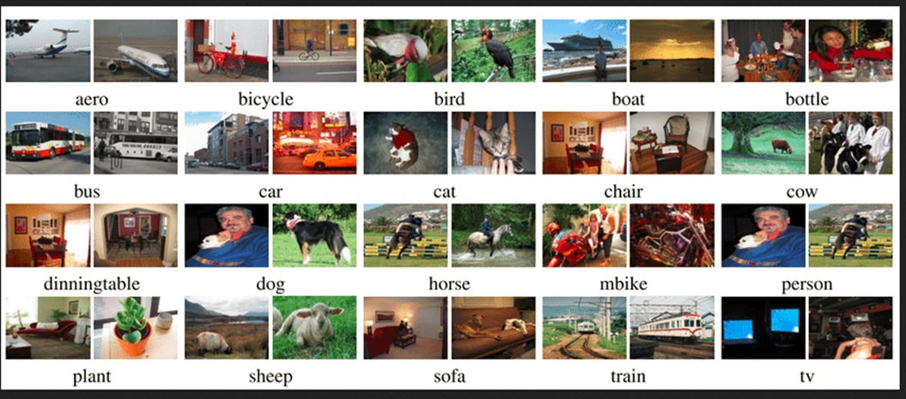
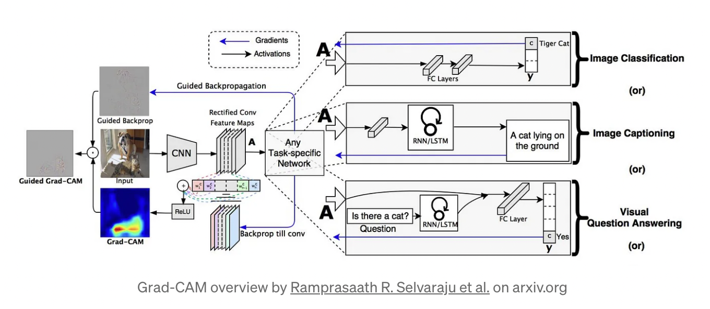

# YOLOv3 Object Detection Explorer

Welcome to the YOLOv3 Object Detection Explorer! 🕵️‍♀️🔍

Uncover the magic of object detection through our interactive Gradio app, powered by the cutting-edge YOLOv3 model. With a focus on flexibility and precision, this app lets you explore the world of computer vision like never before.

## Key Features

- **YOLOv3 at Your Fingertips**: Immerse yourself in the realm of object detection with our YOLOv3 model. Crafted meticulously from scratch using the Pascal VOC dataset's 20 distinct classes, our model guarantees accurate and robust object detection.

- **Insights with GradCAM**: Experience the brilliance of GradCAM (Gradient-weighted Class Activation Mapping), a revolutionary technique that peers into the inner workings of the model. By harnessing gradients, it uncovers the precise regions within an image that heavily influence the classification score, offering a deeper understanding of the model's decisions.

- **Tailored Detection Streams**: With three distinct output streams, each providing sizes of 13x13, 26x26, and 52x52, you can adapt your approach based on the size of the objects in focus. Opt for smaller outputs to capture larger objects or opt for larger outputs for finer details.

## How It Works

1. Upload an image you'd like to analyze for object detection.
2. Select the output stream that aligns with your object detection needs.
3. Watch as our YOLOv3 model efficiently identifies and annotates objects within the image.
4. Dive deeper into the process by exploring the GradCAM visualization, shedding light on the pivotal regions driving the model's classification.

## Explore and Learn

Visit the "Examples" tab to embark on a visual journey. Explore pre-loaded images of varying complexity to witness YOLOv3's prowess firsthand. Delve into the GradCAM outputs to gain insights into how different output streams impact the model's attention.

## Get Started

Ready to unveil the mysteries of object detection and GradCAM? Launch the YOLOv3 Object Detection Explorer and unravel the captivating world of computer vision today!

>Please refer to the training repo - https://github.com/Madhur-1/ERA-v1/edit/master/S13 for more details on the training.

## Model Structure

## PASCAL VOC Dataset
The Pascal VOC (Visual Object Classes) dataset is a widely used benchmark in computer vision. It consists of 20 classes covering a wide range of objects commonly found in everyday scenes. The dataset is a valuable resource for training and evaluating object detection models like YOLOv3.

#### Classes in the Pascal VOC Dataset
1. Aeroplane
2. Bicycle
3. Bird
4. Boat
5. Bottle
6. Bus
7. Car
8. Cat
9. Chair
10. Cow
11. Dining Table
12. Dog
13. Horse
14. Motorbike
15. Person
16. Potted Plant
17. Sheep
18. Sofa
19. Train
20. TV/Monitor

## Data Exploration

## Model Metrics
| Class Acc | No Obj Acc |   Obj Acc  | MAP       | Train Loss | Test Loss |
|-----------|------------|------------|-----------|------------|-----------|
| 88.99     | 98.19      | 77.58      | 0.43      | 3.19       | 2.73      |

Note: The above loss values use lambda_class = 1, lambda_noobj = 5, lambda_obj = 1, lambda_box = 5.

## Grad-CAM
Note: The following has been taken from https://towardsdatascience.com/understand-your-algorithm-with-grad-cam-d3b62fce353

Gradient-weighted Class Activation Mapping (Grad-CAM), uses the gradients of any target concept (say ‘dog’ in a classification network or a sequence of words in captioning network) flowing into the final convolutional layer to produce a coarse localization map highlighting the important regions in the image for predicting the concept.

---
