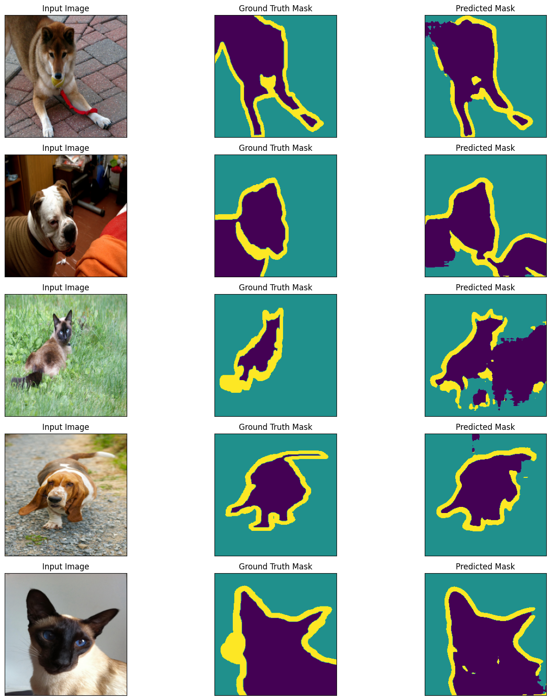

# Session 18

## Introduction

This assignment is split into two parts:

a. Training a U-Net on the Oxford Pets Dataset. Then comparing different variants of the U-Net architecture and loss function.
b. Training VAE's on the MNIST and CIFAR10 datasets. The twist to the assignment is that the image labels are also to be considered while training the VAE's. Thus given an image, the VAE should be able to reconstruct the image and also predict the label of the image. Now given a wrong label, the VAE should be able to reconstruct the image but the reconstructed image should be different from the original image and the predicted label should match the given label.

# Part A | U-Net

## Structure

- The output consists of 3 channels, one for each class (1: Foreground 2:Background 3: Not classified).
- The models are all trained for 25 epochs.

## Metrics
|                  | Test Acc | Train Loss | Test Loss |
|------------------|----------|------------|-----------|
| MP+TR+CE         | 89.83    | 0.15       | 0.33      |
| MP+TR+DICE       | 87.95    | 0.06       | 0.07      |
| StrConv+TR+CE    | 88.48    | 0.19       | 0.35      |
| StrConv+UPS+DICE | 86.99    | 0.06       | 0.7       |

## Performance Curve
|Legend | Val Acc      | Val Acc (Smoothed) |
| ---------- | ----------- | ----------- |
|||")|

### Some observations
1. Comparing A and C - The only difference is the channel-size reduction method used (MaxPooling in A and StridedConvolution in C). We see that a outperforms C by a small margin in accuracy. Thus MaxPooling is preferred for a U-Net.
2. Comparing A and B - The only difference is the loss function used (Cross-Entropy in A and Dice in B). We see that A outperforms B by a huge margin. Thus Cross-Entropy should be preferred.
3. Now comparing B and D - The difference here is in both channel-size reduction method and  channel-size expansion method. The graph shows almost similar learning curves. Thus, we can say that given StrConv < MP (using 1.) - Upsampling > Transpose Strided Convolution.

## Data Exploration

#### MP+TR+CE

#### MP+TR+DICE

#### StrConv+TR+CE

#### StrConv+UPS+DICE

# Part B | VAE

## Structure

The VAE's have a Encoder-Decoder structure. 

There is an extra input - the label of the image (we perturb the input label to not match the input image for say 10% of the times). 
This label is passed through an embedding layer and then added to the mu and sigma layers of the latent space.
The final reconstructed image is passed through a classification network (usually the encoder network, pretrained to predict the output label with a classification head) to predict the label of the image and this is compared with the given label. The NLLLoss of this prediction is added to the loss function, weighted by a factor of `lamda_label_loss`.

This is done so that the VAE learns to reconstruct the image and also predict the label of the image. There is now a trade-off between the reconstruction loss and the label prediction loss. The label prediction loss is weighted by `lamda_label_loss` to control the trade-off. Finally, we get a VAE that tries to get the best of both worlds by reconstructing the image in the style of the original image but corresponding to the given label.

### MNIST VAE

- Latent Size: 10
- lamda_label_loss: 100
- Encoder: 8000 param model from S7
- Decoder: Similar to Encoder but in reverse
- Epochs: 30

### CIFAR10 VAE

- Latent Size: 512 (As reconstruction of CIFAR10 images is more complex)
- lamda_label_loss: 300 (As we are dealing with 3*reconstruction loss- due to presence of 3 channel input)
- Encoder: Kakao Brain's Architecture from S10 & S12
- Decoder: Similar to Encoder but in reverse
- Epochs: 30

## Metrics
|         | Total Loss (-R+KL+L) | Recon Loss | KL Divergence | Label Loss (x lamda) |
|---------|----------------------|------------|---------------|----------------------|
| MNIST   | 686                  | -627       | 30            | 4                    |
| CIFAR10 | 1733                 | -1451      | 188           | 72                   |

## Performance Curve

## Data Exploration

### MNIST

### CIFAR10

### Some observations
- The Reconstructed Images are blurry. This can be seen as a result of using VAE's. VAE's are generative models and thus the reconstructed images are not very sharp. This is because the VAE's are trained to learn the distribution of the input data and thus the reconstructed images are a result of sampling from this distribution (which is usually in a much lower dimension - the latent space). Thus, the reconstructed images are not very sharp.
- The model seems to be doing a very good job for reconstructing the image in the MNIST case. In case the given label does not match the input image the model tries to modify the given image to match the given label.
- For the CIFAR dataset, the model reconstructions are too blurry. This is because the CIFAR dataset is much more complex than the MNIST dataset. Thus commenting on the model's ability to modify the image to match the given label is not helpful. One reason for this might be that the given model is not powerful enough for the CIFAR dataset. Thus, a more powerful model (Resnet-34) might be able to do a better job at this task.