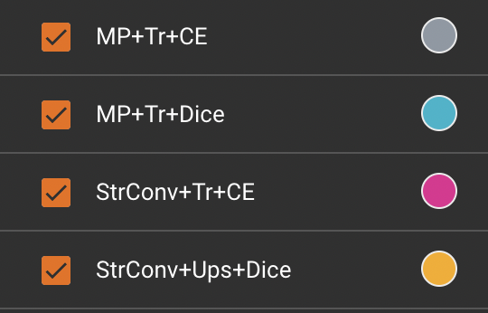
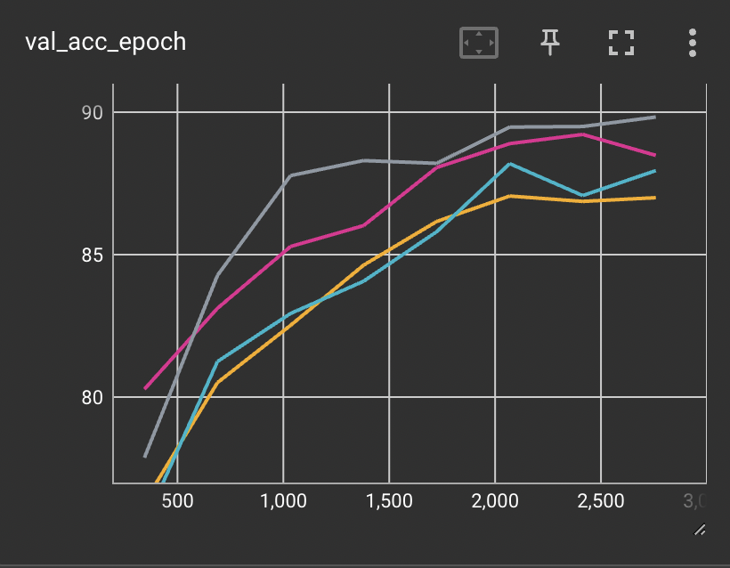

")

## Some observations
1. Comparing A and C - The only difference is the channel-size reduction method used (MaxPooling in A and StridedConvolution in C). We see that a outperforms C by a small margin in accuracy. Thus MaxPooling is preferred for a U-Net.
2. Comparing A and B - The only difference is the loss function used (Cross-Entropy in A and Dice in B). We see that A outperforms B by a huge margin. Thus Cross-Entropy should be preferred.
3. Now comparing B and D - The difference here is in both channel-size reduction method and  channel-size expansion method. The graph shows almost similar learning curves. Thus, we can say that given StrConv < MP (using 1.) - Upsampling > Transpose Strided Convolution.
