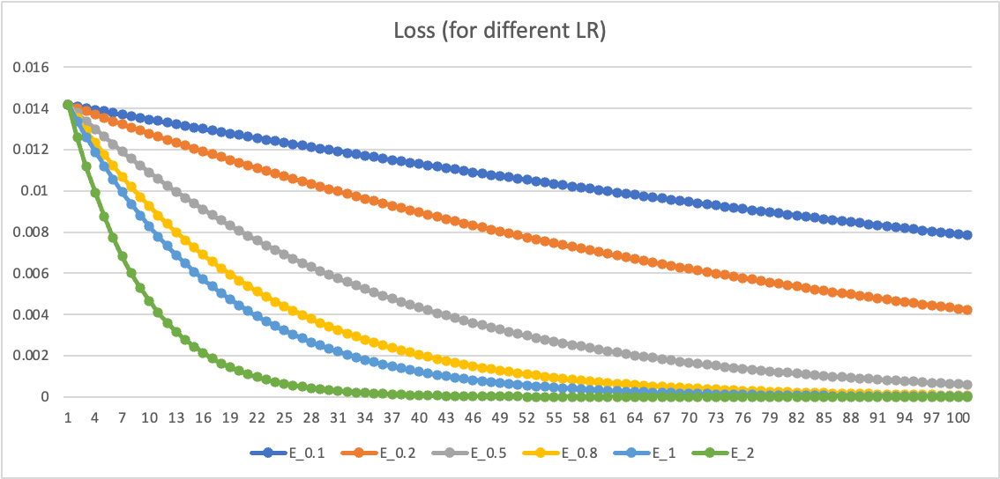
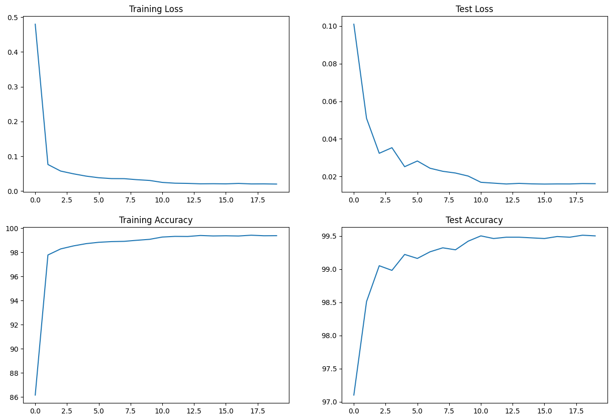

# Session 6

## Introduction

This assignment is focussed towards grasping Backpropagation and Architectural Basics. The assignment is divided into 2 parts as described below.

## Part 1

This part involves using MS Excel to perform backprop on a arbitrary defined Neural network.



The above screenshot depicts the training stat while varying the learning rates. We see that as we increase the learning rates we reach the saturation point faster.

The directory also contains `Screenshot 1.png` and `Screenshot 2.png` depicting the working of the backprop algorithm.

## Part 2

### Target
1. Accuracy > 99.4%
2. Number of Parameters < 20k
3. Num Epochs < 20

### Structure

```
----------------------------------------------------------------
        Layer (type)               Output Shape         Param #
================================================================
            Conv2d-1           [-1, 16, 26, 26]             160
              ReLU-2           [-1, 16, 26, 26]               0
       BatchNorm2d-3           [-1, 16, 26, 26]              32
            Conv2d-4           [-1, 16, 24, 24]           2,320
              ReLU-5           [-1, 16, 24, 24]               0
       BatchNorm2d-6           [-1, 16, 24, 24]              32
            Conv2d-7           [-1, 30, 22, 22]           4,350
              ReLU-8           [-1, 30, 22, 22]               0
       BatchNorm2d-9           [-1, 30, 22, 22]              60
           Conv2d-10           [-1, 30, 11, 11]             930
             ReLU-11           [-1, 30, 11, 11]               0
      BatchNorm2d-12           [-1, 30, 11, 11]              60
           Conv2d-13             [-1, 16, 9, 9]           4,336
             ReLU-14             [-1, 16, 9, 9]               0
      BatchNorm2d-15             [-1, 16, 9, 9]              32
           Conv2d-16             [-1, 16, 7, 7]           2,320
             ReLU-17             [-1, 16, 7, 7]               0
      BatchNorm2d-18             [-1, 16, 7, 7]              32
           Conv2d-19             [-1, 32, 5, 5]           4,640
             ReLU-20             [-1, 32, 5, 5]               0
      BatchNorm2d-21             [-1, 32, 5, 5]              64
        AvgPool2d-22             [-1, 32, 1, 1]               0
           Linear-23                   [-1, 10]             330
================================================================
Total params: 19,698
Trainable params: 19,698
Non-trainable params: 0
----------------------------------------------------------------
```

### Performance Curve


### Training Stats

```
Adjusting learning rate of group 0 to 5.0000e-02.
Epoch 1
Train: Loss=0.1707 Batch_id=117 Accuracy=86.16: 100%|██████████| 118/118 [00:12<00:00,  9.73it/s]
Test set: Average loss: 0.1010, Accuracy: 9710/10000 (97.10%)

Adjusting learning rate of group 0 to 5.0000e-02.
Epoch 2
Train: Loss=0.0598 Batch_id=117 Accuracy=97.78: 100%|██████████| 118/118 [00:08<00:00, 14.35it/s]
Test set: Average loss: 0.0509, Accuracy: 9851/10000 (98.51%)

Adjusting learning rate of group 0 to 5.0000e-02.
Epoch 3
Train: Loss=0.0275 Batch_id=117 Accuracy=98.28: 100%|██████████| 118/118 [00:08<00:00, 14.45it/s]
Test set: Average loss: 0.0324, Accuracy: 9905/10000 (99.05%)

Adjusting learning rate of group 0 to 5.0000e-02.
Epoch 4
Train: Loss=0.0924 Batch_id=117 Accuracy=98.53: 100%|██████████| 118/118 [00:08<00:00, 14.48it/s]
Test set: Average loss: 0.0353, Accuracy: 9898/10000 (98.98%)

Adjusting learning rate of group 0 to 5.0000e-02.
Epoch 5
Train: Loss=0.0505 Batch_id=117 Accuracy=98.72: 100%|██████████| 118/118 [00:08<00:00, 14.45it/s]
Test set: Average loss: 0.0252, Accuracy: 9922/10000 (99.22%)

Adjusting learning rate of group 0 to 5.0000e-02.
Epoch 6
Train: Loss=0.0846 Batch_id=117 Accuracy=98.83: 100%|██████████| 118/118 [00:08<00:00, 14.43it/s]
Test set: Average loss: 0.0283, Accuracy: 9916/10000 (99.16%)

Adjusting learning rate of group 0 to 5.0000e-02.
Epoch 7
Train: Loss=0.0619 Batch_id=117 Accuracy=98.89: 100%|██████████| 118/118 [00:08<00:00, 14.47it/s]
Test set: Average loss: 0.0244, Accuracy: 9926/10000 (99.26%)

Adjusting learning rate of group 0 to 5.0000e-02.
Epoch 8
Train: Loss=0.1067 Batch_id=117 Accuracy=98.91: 100%|██████████| 118/118 [00:08<00:00, 14.42it/s]
Test set: Average loss: 0.0228, Accuracy: 9932/10000 (99.32%)

Adjusting learning rate of group 0 to 5.0000e-02.
Epoch 9
Train: Loss=0.0478 Batch_id=117 Accuracy=99.00: 100%|██████████| 118/118 [00:08<00:00, 14.40it/s]
Test set: Average loss: 0.0219, Accuracy: 9929/10000 (99.29%)

Adjusting learning rate of group 0 to 5.0000e-02.
Epoch 10
Train: Loss=0.0240 Batch_id=117 Accuracy=99.07: 100%|██████████| 118/118 [00:08<00:00, 14.38it/s]
Test set: Average loss: 0.0203, Accuracy: 9942/10000 (99.42%)

Adjusting learning rate of group 0 to 5.0000e-03.
Epoch 11
Train: Loss=0.0192 Batch_id=117 Accuracy=99.26: 100%|██████████| 118/118 [00:08<00:00, 14.36it/s]
Test set: Average loss: 0.0169, Accuracy: 9950/10000 (99.50%)

Adjusting learning rate of group 0 to 5.0000e-03.
Epoch 12
Train: Loss=0.0026 Batch_id=117 Accuracy=99.32: 100%|██████████| 118/118 [00:08<00:00, 14.25it/s]
Test set: Average loss: 0.0165, Accuracy: 9946/10000 (99.46%)

Adjusting learning rate of group 0 to 5.0000e-03.
Epoch 13
Train: Loss=0.0157 Batch_id=117 Accuracy=99.31: 100%|██████████| 118/118 [00:08<00:00, 14.26it/s]
Test set: Average loss: 0.0160, Accuracy: 9948/10000 (99.48%)

Adjusting learning rate of group 0 to 5.0000e-03.
Epoch 14
Train: Loss=0.0381 Batch_id=117 Accuracy=99.39: 100%|██████████| 118/118 [00:08<00:00, 14.16it/s]
Test set: Average loss: 0.0164, Accuracy: 9948/10000 (99.48%)

Adjusting learning rate of group 0 to 5.0000e-03.
Epoch 15
Train: Loss=0.0160 Batch_id=117 Accuracy=99.35: 100%|██████████| 118/118 [00:08<00:00, 14.11it/s]
Test set: Average loss: 0.0161, Accuracy: 9947/10000 (99.47%)

Adjusting learning rate of group 0 to 5.0000e-03.
Epoch 16
Train: Loss=0.0137 Batch_id=117 Accuracy=99.37: 100%|██████████| 118/118 [00:08<00:00, 13.75it/s]
Test set: Average loss: 0.0160, Accuracy: 9946/10000 (99.46%)

Adjusting learning rate of group 0 to 5.0000e-03.
Epoch 17
Train: Loss=0.1291 Batch_id=117 Accuracy=99.35: 100%|██████████| 118/118 [00:08<00:00, 14.05it/s]
Test set: Average loss: 0.0161, Accuracy: 9949/10000 (99.49%)

Adjusting learning rate of group 0 to 5.0000e-03.
Epoch 18
Train: Loss=0.0190 Batch_id=117 Accuracy=99.42: 100%|██████████| 118/118 [00:08<00:00, 13.94it/s]
Test set: Average loss: 0.0161, Accuracy: 9948/10000 (99.48%)

Adjusting learning rate of group 0 to 5.0000e-03.
Epoch 19
Train: Loss=0.0319 Batch_id=117 Accuracy=99.37: 100%|██████████| 118/118 [00:08<00:00, 14.05it/s]
Test set: Average loss: 0.0163, Accuracy: 9951/10000 (99.51%)

Adjusting learning rate of group 0 to 5.0000e-03.
Epoch 20
Train: Loss=0.0112 Batch_id=117 Accuracy=99.38: 100%|██████████| 118/118 [00:08<00:00, 13.99it/s]
Test set: Average loss: 0.0162, Accuracy: 9950/10000 (99.50%)

Adjusting learning rate of group 0 to 5.0000e-04.
```
